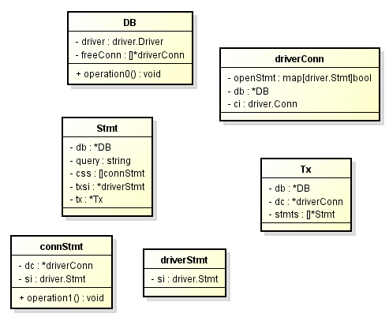

# <center> MySql 数据库 </center>

## golang 使用 三方库调用 mysql 数据库
1. 引入三方库
  ```js
  go get github.com/go-sql-driver/mysql
  ```
2. 导入库
    go get -u github.com/go-sql-driver/mysql
  ```js
  import "database/sql"
  import _ "github.com/go-sql-driver/mysql"
  ```
3. 连接数据库
  ```js
  db, err := sql.Open("mysql", "root:root@/uestcbook")
  ```
## 执行查询
1. exec
   ```js
   result, err := db.Exec(
    "INSERT INTO users (name, age) VALUES (?, ?)",
    "gopher",
    27,
    )
   ```
2. Query
   ```js
    rows, err := db.Query("SELECT name FROM users WHERE age = ?", age)
      if err != nil {
          log.Fatal(err)
      }
      for rows.Next() {
          var name string
          if err := rows.Scan(&name); err != nil {
              log.Fatal(err)
          }
          fmt.Printf("%s is %d\n", name, age)
      }
      if err := rows.Err(); err != nil {
          log.Fatal(err)
      }
   ```
3. QueryRow
  ```js
    var age int64
    row := db.QueryRow("SELECT age FROM users WHERE name = ?", name)
   err := row.Scan(&age)
  ```

4. Prepared statements 
   ```js
   age := 27
   stmt, err := db.Prepare("SELECT name FROM users WHERE age = ?")
   if err != nil {
       log.Fatal(err)
   }
   rows, err := stmt.Query(age)
   // process rows
   ```

5. 事物
   ```js
    tx, err := db.Begin()
    if err != nil {
      log.Fatal(err)
    }
   ```
### problem
#### unknown driver "mysql" (forgotten import?)
1. 头部引用 
  ```sql
  _ "github.com/go-sql-driver/mysql"
  ```

### 各种方式效率分析
#### db.exec和statement.exec和tx.exec的区别？

```js
package main

import (
    "strconv"
    "database/sql"
    _ "github.com/go-sql-driver/mysql"
    "fmt"
    "time"
    "log"
)

var db = &sql.DB{}

func init(){
    db,_ = sql.Open("mysql", "root:root@/book")
} 

func main() {
    insert()
    query()
    update()
    query()
    delete()
}

func update(){
    //方式1 update
    start := time.Now()
    for i := 1001;i<=1100;i++{
        db.Exec("UPdate user set age=? where uid=? ",i,i)
    }
    end := time.Now()
    fmt.Println("方式1 update total time:",end.Sub(start).Seconds())
    
    //方式2 update
    start = time.Now()
    for i := 1101;i<=1200;i++{
        stm,_ := db.Prepare("UPdate user set age=? where uid=? ")
        stm.Exec(i,i)
        stm.Close()
    }
    end = time.Now()
    fmt.Println("方式2 update total time:",end.Sub(start).Seconds())
    
    //方式3 update
    start = time.Now()
    stm,_ := db.Prepare("UPdate user set age=? where uid=?")
    for i := 1201;i<=1300;i++{
        stm.Exec(i,i)
    }
    stm.Close()
    end = time.Now()
    fmt.Println("方式3 update total time:",end.Sub(start).Seconds())
    
    //方式4 update
    start = time.Now()
    tx,_ := db.Begin()
    for i := 1301;i<=1400;i++{
        tx.Exec("UPdate user set age=? where uid=?",i,i)
    }
    tx.Commit()
    
    end = time.Now()
    fmt.Println("方式4 update total time:",end.Sub(start).Seconds())
    
    //方式5 update
    start = time.Now()
    for i := 1401;i<=1500;i++{
        tx,_ := db.Begin()
        tx.Exec("UPdate user set age=? where uid=?",i,i)
        tx.Commit()
    }
    end = time.Now()
    fmt.Println("方式5 update total time:",end.Sub(start).Seconds())
    
}

func delete(){
    //方式1 delete
    start := time.Now()
    for i := 1001;i<=1100;i++{
        db.Exec("DELETE FROM USER WHERE uid=?",i)
    }
    end := time.Now()
    fmt.Println("方式1 delete total time:",end.Sub(start).Seconds())
    
    //方式2 delete
    start = time.Now()
    for i := 1101;i<=1200;i++{
        stm,_ := db.Prepare("DELETE FROM USER WHERE uid=?")
        stm.Exec(i)
        stm.Close()
    }
    end = time.Now()
    fmt.Println("方式2 delete total time:",end.Sub(start).Seconds())
    
    //方式3 delete
    start = time.Now()
    stm,_ := db.Prepare("DELETE FROM USER WHERE uid=?")
    for i := 1201;i<=1300;i++{
        stm.Exec(i)
    }
    stm.Close()
    end = time.Now()
    fmt.Println("方式3 delete total time:",end.Sub(start).Seconds())
    
    //方式4 delete
    start = time.Now()
    tx,_ := db.Begin()
    for i := 1301;i<=1400;i++{
        tx.Exec("DELETE FROM USER WHERE uid=?",i)
    }
    tx.Commit()
    
    end = time.Now()
    fmt.Println("方式4 delete total time:",end.Sub(start).Seconds())
    
    //方式5 delete
    start = time.Now()
    for i := 1401;i<=1500;i++{
        tx,_ := db.Begin()
        tx.Exec("DELETE FROM USER WHERE uid=?",i)
        tx.Commit()
    }
    end = time.Now()
    fmt.Println("方式5 delete total time:",end.Sub(start).Seconds())
    
}

func query(){
    
    //方式1 query
    start := time.Now()
    rows,_ := db.Query("SELECT uid,username FROM USER")
    defer rows.Close()
    for rows.Next(){
         var name string
         var id int
        if err := rows.Scan(&id,&name); err != nil {
            log.Fatal(err)
        }
        //fmt.Printf("name:%s ,id:is %d\n", name, id)
    }
    end := time.Now()
    fmt.Println("方式1 query total time:",end.Sub(start).Seconds())
    
    //方式2 query
    start = time.Now()
    stm,_ := db.Prepare("SELECT uid,username FROM USER")
    defer stm.Close()
    rows,_ = stm.Query()
    defer rows.Close()
    for rows.Next(){
         var name string
         var id int
        if err := rows.Scan(&id,&name); err != nil {
            log.Fatal(err)
        }
       // fmt.Printf("name:%s ,id:is %d\n", name, id)
    }
    end = time.Now()
    fmt.Println("方式2 query total time:",end.Sub(start).Seconds())
    
    
    //方式3 query
    start = time.Now()
    tx,_ := db.Begin()
    defer tx.Commit()
    rows,_ = tx.Query("SELECT uid,username FROM USER")
    defer rows.Close()
    for rows.Next(){
         var name string
         var id int
        if err := rows.Scan(&id,&name); err != nil {
            log.Fatal(err)
        }
        //fmt.Printf("name:%s ,id:is %d\n", name, id)
    }
    end = time.Now()
    fmt.Println("方式3 query total time:",end.Sub(start).Seconds())
}

func insert() {
    
    //方式1 insert
    //strconv,int转string:strconv.Itoa(i)
    start := time.Now()
    for i := 1001;i<=1100;i++{
        //每次循环内部都会去连接池获取一个新的连接，效率低下
        db.Exec("INSERT INTO user(uid,username,age) values(?,?,?)",i,"user"+strconv.Itoa(i),i-1000)
    }
    end := time.Now()
    fmt.Println("方式1 insert total time:",end.Sub(start).Seconds())
    
    //方式2 insert
    start = time.Now()
    for i := 1101;i<=1200;i++{
        //Prepare函数每次循环内部都会去连接池获取一个新的连接，效率低下
        stm,_ := db.Prepare("INSERT INTO user(uid,username,age) values(?,?,?)")
        stm.Exec(i,"user"+strconv.Itoa(i),i-1000)
        stm.Close()
    }
    end = time.Now()
    fmt.Println("方式2 insert total time:",end.Sub(start).Seconds())
    
    //方式3 insert
    start = time.Now()
    stm,_ := db.Prepare("INSERT INTO user(uid,username,age) values(?,?,?)")
    for i := 1201;i<=1300;i++{
        //Exec内部并没有去获取连接，为什么效率还是低呢？
        stm.Exec(i,"user"+strconv.Itoa(i),i-1000)
    }
    stm.Close()
    end = time.Now()
    fmt.Println("方式3 insert total time:",end.Sub(start).Seconds())
    
    //方式4 insert
    start = time.Now()
    //Begin函数内部会去获取连接
    tx,_ := db.Begin()
    for i := 1301;i<=1400;i++{
        //每次循环用的都是tx内部的连接，没有新建连接，效率高
        tx.Exec("INSERT INTO user(uid,username,age) values(?,?,?)",i,"user"+strconv.Itoa(i),i-1000)
    }
    //最后释放tx内部的连接
    tx.Commit()
    
    end = time.Now()
    fmt.Println("方式4 insert total time:",end.Sub(start).Seconds())
    
    //方式5 insert
    start = time.Now()
    for i := 1401;i<=1500;i++{
        //Begin函数每次循环内部都会去连接池获取一个新的连接，效率低下
        tx,_ := db.Begin()
        tx.Exec("INSERT INTO user(uid,username,age) values(?,?,?)",i,"user"+strconv.Itoa(i),i-1000)
        //Commit执行后连接也释放了
        tx.Commit()
    }
    end = time.Now()
    fmt.Println("方式5 insert total time:",end.Sub(start).Seconds())
}
```

#### 深入内部分析原因分析
1. sql.Open("mysql", "username:pwd@/databasename")

功能：返回一个DB对象，DB对象对于多个goroutines并发使用是安全的，DB对象内部封装了连接池。

实现：open函数并没有创建连接，它只是验证参数是否合法。然后开启一个单独goroutines去监听是否需要建立新的连接，当有请求建立新连接时就创建新连接。

注意：open函数应该被调用一次，通常是没必要close的。

 

2. DB.Exec()

        功能：执行不返回行（row）的查询，比如INSERT，UPDATE，DELETE

        实现：DB交给内部的exec方法负责查询。exec会首先调用DB内部的conn方法从连接池里面获得一个连接。然后检查内部的driver.Conn实现了Execer接口没有，如果实现了该接口，会调用Execer接口的Exec方法执行查询；否则调用Conn接口的Prepare方法负责查询。

 

3. DB.Query()

        功能：用于检索（retrieval），比如SELECT

        实现：DB交给内部的query方法负责查询。query首先调用DB内部的conn方法从连接池里面获得一个连接，然后调用内部的queryConn方法负责查询。

 
4. DB.QueryRow()

        功能：用于返回单行的查询

        实现：转交给DB.Query()查询

 

5. db.Prepare()

        功能：返回一个Stmt。Stmt对象可以执行Exec,Query,QueryRow等操作。

        实现：DB交给内部的prepare方法负责查询。prepare首先调用DB内部的conn方法从连接池里面获得一个连接，然后调用driverConn的prepareLocked方法负责查询。

        Stmt相关方法：

        st.Exec()

        st.Query()

        st.QueryRow()

        st.Close()

 

6. db.Begin()

        功能：开启事务，返回Tx对象。调用该方法后，这个TX就和指定的连接绑定在一起了。一旦事务提交或者回滚，该事务绑定的连接就还给DB的连接池。

        实现：DB交给内部的begin方法负责处理。begin首先调用DB内部的conn方法从连接池里面获得一个连接，然后调用Conn接口的Begin方法获得一个TX。

        TX相关方法：

        //内部执行流程和上面那些差不多，只是没有先去获取连接的一步，因为这些操作是和TX关联的，Tx建立的时候就和一个连接绑定了，所以这些操作内部共用一个TX内部的连接。

        tx.Exec() 

        tx.Query()

        tx.QueryRow()

        tx.Prepare()

        tx.Commit()

        tx.Rollback()

        tx.Stmt()//用于将一个已存在的statement和tx绑定在一起。一个statement可以不和tx关联，比如db.Prepare()返回的statement就没有和TX关联。

例子：

    updateMoney, err := db.Prepare("UPDATE balance SET money=money+? WHERE id=?")

    ...

    tx, err := db.Begin()

    ...

    res, err := tx.Stmt(updateMoney).Exec(123.45, 98293203)

1. 源码中Stmt的定义

        type Stmt struct {

         // Immutable:

         db        *DB    // where we came from

         query     string // that created the Stmt

         stickyErr error  // if non-nil, this error is returned for all operations

 

         closemu sync.RWMutex // held exclusively during close, for read otherwise.

 

         // If in a transaction, else both nil:

         tx   *Tx

         txsi *driverStmt

 

         mu     sync.Mutex // protects the rest of the fields

         closed bool

 

         // css is a list of underlying driver statement interfaces

         // that are valid on particular connections.  This is only

         // used if tx == nil and one is found that has idle

         // connections.  If tx != nil, txsi is always used.

         css []connStmt
        }
    



[引用链接](https://www.cnblogs.com/shiluoliming/p/7904547.html)


### 数据库数据为 null 的问题

[数据库为 null 的问题](https://blog.csdn.net/robertkun/article/details/79157599)